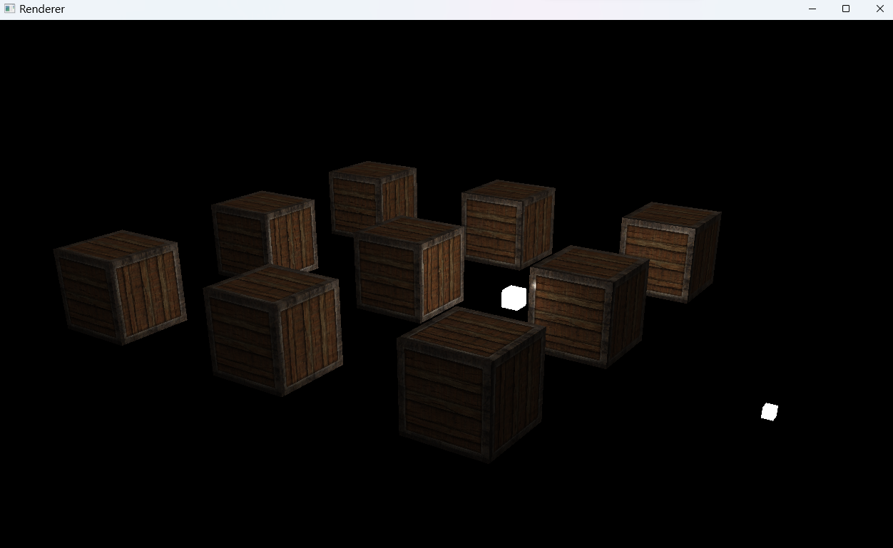

# OpenGL Texture Rendering Demo

- C:\3Dproject\docs\gpu_pipeline_spec.md

## Features

- OpenGL 3.3 Core Profile
- Texture mapping (multi-texture blending)
- Shader abstraction (C++ class wrapper)
- stb_image image loading
- Basic camera system (FPS-style)
- Phong lighting model (Directional + Point + Spot lights)
- Scene / Renderer separation (mini engine architecture v0.1)

---

## Demo

Render a textured cube scene with:
- Multiple point lights
- Directional light
- Camera-controlled first-person view
- Debug light visualization cubes

---

## Build

```bash
mkdir build
cd build
cmake ..
cmake --build .
```
---

## Dependencies

```bash
GLFW
GLAD
stb_image
GLM
```
---

## Structure

```bash
src/
 ├─ core/        # Renderer
 ├─ graphics/    # Shader / Texture
 ├─ objects/     # Mesh implementations (Cube)
 ├─ scene/       # Scene & Light management
include/
shaders/
```
---

## Current Architecture

Scene contains:
Objects (Mesh + Transform)
Light data (Dir / Point / Spot)
Renderer handles:
Camera matrices
Uniform upload
Draw calls
Mesh abstraction:
Cube implements Mesh interface
Status

```bash
✔ Texture rendering
✔ Lighting system (Phong)
✔ Camera movement
✔ Scene system
✔ Renderer abstraction
```
---
# demo.png



